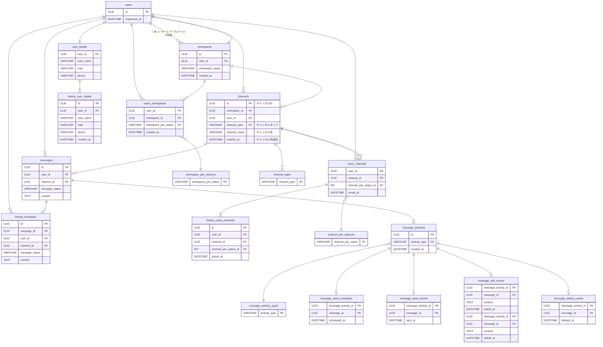

## 回答1
次のようなスキーマを考えました。

```mermaid
erDiagram

users ||--o{ workspaces: "1:多 ユーザーとワークスペース作成者"
users ||--o{ channels: ""
users ||--|| user_details: ""
users ||--o{ messages: ""
users ||--o{ thread_messages: ""
users ||--o{ users_workspaces: ""
users ||--o{ users_channels: ""

user_details ||--|{ history_user_details: ""

workspaces ||--o{ users_workspaces: ""
workspaces ||--o{ channels: ""
workspaces ||--o{ users: ""

users_workspaces }o--|| workspace_join_statuses: ""

channels ||--o{ users_channels: ""
channels ||--o{ channel_types: ""
channels ||--o{ users_channels: ""
channels ||--o{ messages: ""

users_channels ||--|{ history_users_channels: ""
users_channels }o--|| channel_join_statuses: ""

messages ||--o{ thread_messages: ""
messages ||--|{ message_activities: ""

message_activities }o--|| message_acitivity_types: ""
message_activities ||--|o message_send_schedules: ""
message_activities ||--|o message_send_events: ""
message_activities ||--|o message_edit_events: ""
message_activities ||--|o message_delete_events: ""

channels {
    ULID id PK "チャンネルID"
    ULID workspace_id FK
    ULID user_id FK
    VARCHAR channel_type FK "チャンネルタイプ"
    VARCHAR channel_name "チャンネル名"
    DATETIME created_at "チャンネル作成日"
}

users_channels {
    ULID user_id PK
    ULID channel_id PK
    INT channel_join_status_id FK
    DATETIME joined_at
}

history_users_channels {
    ULID id PK
    ULID user_id FK
    ULID channel_id FK
    INT channel_join_status_id FK
    DATETIME joined_at
}

messages {
    ULID id PK
    ULID user_id FK
    ULID channel_id FK
    VARCHAR message_status
    TEXT content
}

message_activities {
    ULID id PK
    VARCHAR acitivity_type FK
    DATETIME created_at
}

message_acitivity_types {
    VARCHAR acitivity_type PK
}

message_send_schedules {
    ULID message_activity_id PK
    ULID message_id FK
    DATETIME scheduled_at
}

message_send_events {
    ULID message_activity_id PK
    ULID message_id FK
    DATETIME sent_at
}

message_edit_events {
    ULID message_activity_id PK
    ULID message_id FK
    TEXT content
    DATETIME edited_at
}

message_edit_events {
    ULID message_activity_id PK
    ULID message_id FK
    TEXT content
    DATETIME edited_at
}

message_delete_events {
    ULID message_activity_id PK
    ULID message_id FK
    DATETIME deleted_at
}

thread_messages {
    ULID id PK
    ULID message_id FK
    ULID user_id FK
    ULID channel_id FK
    VARCHAR message_status
    TEXT content
}

channel_types {
    VARCHAR channel_type PK
}

workspace_join_statuses {
    VARCHAR workspace_join_status PK
}

channel_join_statuses {
    VARCHAR channel_join_status PK
}

users {
    ULID id PK
    DATETIME registered_at
}

user_details {
    ULID user_id PK
    VARCHAR user_name
    VARCHAR mail
    VARCHAR phone
}

history_user_details {
    ULID id PK
    ULID user_id FK
    VARCHAR user_name
    VARCHAR mail
    VARCHAR phone
    DATETIME created_at
}

workspaces {
    ULID id PK
    ULID user_id FK
    VARCHAR workspace_name
    DATETIME created_at
}

users_workspaces {
    ULID user_id PK
    ULID workspace_id PK
    VARCHAR workspace_join_status FK
    DATETIME created_at
}


```