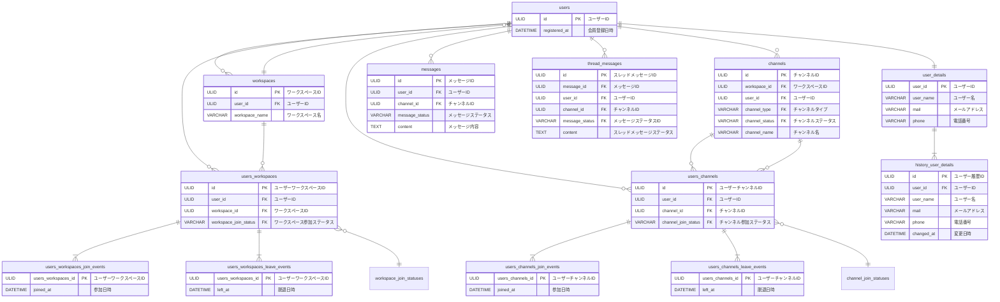
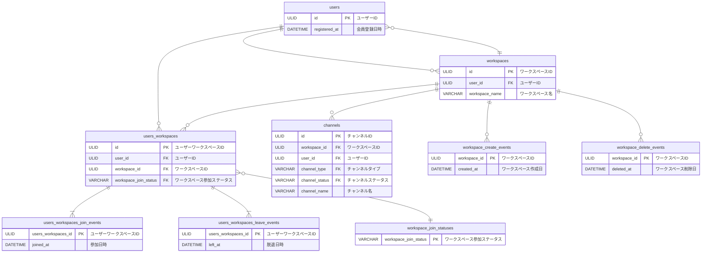
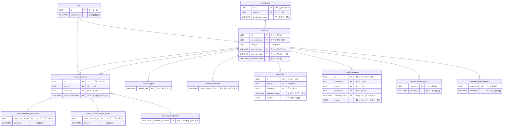
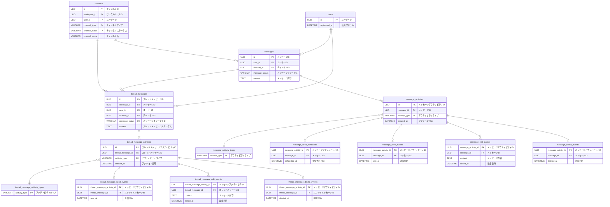
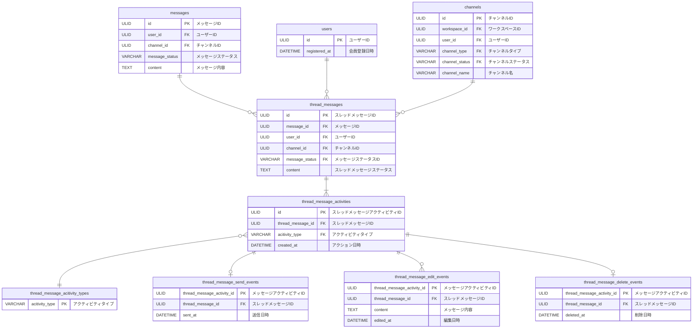

イミュータブルデータモデルの概念を踏まえて作成
## ユーザーエンティティ周辺

```mermaid
erDiagram

users ||--o{ workspaces: ""
users ||--o{ channels: ""
users ||--|| user_details: ""
users ||--o{ messages: ""
users ||--o{ thread_messages: ""
users ||--o{ users_workspaces: ""
users ||--o{ users_channels: ""

user_details ||--|{ history_user_details: ""

workspaces ||--o{ users_workspaces: ""
workspaces ||--o{ users: ""


users_workspaces ||--|{ users_workspaces_join_events : ""
users_workspaces ||--|{ users_workspaces_leave_events : ""
users_workspaces }o--|| workspace_join_statuses: ""


channels ||--o{ users_channels: ""
channels ||--o{ users_channels: ""


users_channels ||--|{ users_channels_join_events : ""
users_channels ||--|{ users_channels_leave_events : ""
users_channels }o--|| channel_join_statuses: ""

channels {
    ULID id PK "チャンネルID"
    ULID workspace_id FK "ワークスペースID"
    ULID user_id FK "ユーザーID"
    VARCHAR channel_type FK "チャンネルタイプ"
    VARCHAR channel_status FK "チャンネルステータス"
    VARCHAR channel_name "チャンネル名"
}


users_channels {
    ULID id PK "ユーザーチャンネルID"
    ULID user_id FK "ユーザーID"
    ULID channel_id FK "チャンネルID"
    VARCHAR channel_join_status FK "チャンネル参加ステータス"
}

users_channels_join_events {
    ULID users_channels_id PK "ユーザーチャンネルID"
    DATETIME joined_at "参加日時"
}

users_channels_leave_events {
    ULID users_channels_id PK "ユーザーチャンネルID"
    DATETIME left_at "脱退日時"
}

messages {
    ULID id PK "メッセージID"
    ULID user_id FK "ユーザーID"
    ULID channel_id FK "チャンネルID"
    VARCHAR message_status "メッセージステータス"
    TEXT content "メッセージ内容"
}

thread_messages {
    ULID id PK "スレッドメッセージID"
    ULID message_id FK "メッセージID"
    ULID user_id FK "ユーザーID"
    ULID channel_id FK "チャンネルID"
    VARCHAR message_status FK "メッセージステータスID"
    TEXT content "スレッドメッセージステータス"
}

users {
    ULID id PK "ユーザーID"
    DATETIME registered_at "会員登録日時"
}

user_details {
    ULID user_id PK "ユーザーID"
    VARCHAR user_name "ユーザー名"
    VARCHAR mail "メールアドレス"
    VARCHAR phone "電話番号"
}

history_user_details {
    ULID id PK "ユーザー履歴ID"
    ULID user_id FK "ユーザーID"
    VARCHAR user_name "ユーザー名"
    VARCHAR mail "メールアドレス"
    VARCHAR phone "電話番号"
    DATETIME changed_at "変更日時"
}

workspaces {
    ULID id PK "ワークスペースID"
    ULID user_id FK "ユーザーID"
    VARCHAR workspace_name "ワークスペース名"
}

users_workspaces {
    ULID id PK "ユーザーワークスペースID"
    ULID user_id FK "ユーザーID"
    ULID workspace_id FK "ワークスペースID"
    VARCHAR workspace_join_status FK "ワークスペース参加ステータス"
}

users_workspaces_join_events {
    ULID users_workspaces_id PK "ユーザーワークスペースID"
    DATETIME joined_at "参加日時"
}

users_workspaces_leave_events {
    ULID users_workspaces_id PK "ユーザーワークスペースID"
    DATETIME left_at "脱退日時"
}


```

## ワークスペースエンティティ周辺

```mermaid
erDiagram

users ||--o{ workspaces: ""
users ||--o{ users_workspaces: ""

workspaces ||--o{ users_workspaces: ""
workspaces ||--o{ channels: ""
workspaces ||--o{ users: ""
workspaces ||--o{ workspace_create_events: ""
workspaces ||--o{ workspace_delete_events: ""

users_workspaces ||--|{ users_workspaces_join_events : ""
users_workspaces ||--|{ users_workspaces_leave_events : ""
users_workspaces }o--|| workspace_join_statuses: ""


users {
    ULID id PK "ユーザーID"
    DATETIME registered_at "会員登録日時"
}

channels {
    ULID id PK "チャンネルID"
    ULID workspace_id FK "ワークスペースID"
    ULID user_id FK "ユーザーID"
    VARCHAR channel_type FK "チャンネルタイプ"
    VARCHAR channel_status FK "チャンネルステータス"
    VARCHAR channel_name "チャンネル名"
}

workspace_join_statuses {
    VARCHAR workspace_join_status PK "ワークスペース参加ステータス"
}


workspaces {
    ULID id PK "ワークスペースID"
    ULID user_id FK "ユーザーID"
    VARCHAR workspace_name "ワークスペース名"
}

workspace_create_events {
    ULID workspace_id PK "ワークスペースID"
    DATETIME created_at "ワークスペース作成日"
}

workspace_delete_events {
    ULID workspace_id PK "ワークスペースID"
    DATETIME deleted_at "ワークスペース削除日"
}

users_workspaces {
    ULID id PK "ユーザーワークスペースID"
    ULID user_id FK "ユーザーID"
    ULID workspace_id FK "ワークスペースID"
    VARCHAR workspace_join_status FK "ワークスペース参加ステータス"
}

users_workspaces_join_events {
    ULID users_workspaces_id PK "ユーザーワークスペースID"
    DATETIME joined_at "参加日時"
}

users_workspaces_leave_events {
    ULID users_workspaces_id PK "ユーザーワークスペースID"
    DATETIME left_at "脱退日時"
}


```

## チャンネルエンティティ周辺

```mermaid
erDiagram

users ||--o{ channels: ""
users ||--o{ users_channels: ""

workspaces ||--o{ channels: ""


channels ||--o{ users_channels: ""
channels ||--o{ channel_types: ""
channels ||--o{ channel_statuses: ""
channels ||--o{ users_channels: ""
channels ||--o{ messages: ""
channels ||--o{ thread_messages: ""
channels ||--o{ channel_create_events: ""
channels ||--o{ channel_delete_events: ""


users_channels ||--|{ users_channels_join_events : ""
users_channels ||--|{ users_channels_leave_events : ""
users_channels }o--|| channel_join_statuses: ""


channels {
    ULID id PK "チャンネルID"
    ULID workspace_id FK "ワークスペースID"
    ULID user_id FK "ユーザーID"
    VARCHAR channel_type FK "チャンネルタイプ"
    VARCHAR channel_status FK "チャンネルステータス"
    VARCHAR channel_name "チャンネル名"
}

channel_create_events {
    ULID channel_id PK "チャンネルID"
    DATETIME created_at "チャンネル作成日"
}

channel_delete_events {
    ULID channel_id PK "チャンネルID"
    DATETIME deleted_at "チャンネル削除日"
}

channel_statuses {
    VARCHAR channel_status PK "チャンネルステータス"
}

users_channels {
    ULID id PK "ユーザーチャンネルID"
    ULID user_id FK "ユーザーID"
    ULID channel_id FK "チャンネルID"
    VARCHAR channel_join_status FK "チャンネル参加ステータス"
}

users_channels_join_events {
    ULID users_channels_id PK "ユーザーチャンネルID"
    DATETIME joined_at "参加日時"
}

users_channels_leave_events {
    ULID users_channels_id PK "ユーザーチャンネルID"
    DATETIME left_at "脱退日時"
}

messages {
    ULID id PK "メッセージID"
    ULID user_id FK "ユーザーID"
    ULID channel_id FK "チャンネルID"
    VARCHAR message_status "メッセージステータス"
    TEXT content "メッセージ内容"
}


thread_messages {
    ULID id PK "スレッドメッセージID"
    ULID message_id FK "メッセージID"
    ULID user_id FK "ユーザーID"
    ULID channel_id FK "チャンネルID"
    VARCHAR message_status FK "メッセージステータスID"
    TEXT content "スレッドメッセージステータス"
}

channel_types {
    VARCHAR channel_type PK "チャンネルタイプ"
}

channel_join_statuses {
    VARCHAR channel_join_status PK "チャンネル参加ステータス"
}

users {
    ULID id PK "ユーザーID"
    DATETIME registered_at "会員登録日時"
}

workspaces {
    ULID id PK "ワークスペースID"
    ULID user_id FK "ユーザーID"
    VARCHAR workspace_name "ワークスペース名"
}


```

## メッセージエンティティ周辺

```mermaid
erDiagram

messages ||--o{ thread_messages: ""
messages ||--|{ message_activities: ""
channels ||--o{ thread_messages: ""

message_activities }o--|| message_acitivity_types: ""
message_activities ||--|o message_send_schedules: ""
message_activities ||--|o message_send_events: ""
message_activities ||--o{ message_edit_events: ""
message_activities ||--|o message_delete_events: ""

thread_messages ||--|{ thread_message_activities: ""
thread_message_activities }o--|| thread_message_acitivity_types: ""
thread_message_activities ||--|o thread_message_send_events: ""
thread_message_activities ||--o{ thread_message_edit_events: ""
thread_message_activities ||--|o thread_message_delete_events: ""

users ||--o{ messages: ""
users ||--o{ thread_messages: ""

channels ||--o{ messages: ""


channels {
    ULID id PK "チャンネルID"
    ULID workspace_id FK "ワークスペースID"
    ULID user_id FK "ユーザーID"
    VARCHAR channel_type FK "チャンネルタイプ"
    VARCHAR channel_status FK "チャンネルステータス"
    VARCHAR channel_name "チャンネル名"
}

messages {
    ULID id PK "メッセージID"
    ULID user_id FK "ユーザーID"
    ULID channel_id FK "チャンネルID"
    VARCHAR message_status "メッセージステータス"
    TEXT content "メッセージ内容"
}

message_activities {
    ULID id PK "メッセージアクティビティID"
    ULID message_id FK "メッセージID"
    VARCHAR acitivity_type FK "アクティビティタイプ"
    DATETIME created_at "アクション日時"
}

message_acitivity_types {
    VARCHAR acitivity_type PK "アクティビティタイプ"
}

message_send_schedules {
    ULID message_activity_id PK "メッセージアクティビティID"
    ULID message_id FK "メッセージID"
    DATETIME scheduled_at "送信予定日時"
}

message_send_events {
    ULID message_activity_id PK "メッセージアクティビティID"
    ULID message_id FK "メッセージID"
    DATETIME sent_at "送信日時"
}

message_edit_events {
    ULID message_activity_id PK "メッセージアクティビティID"
    ULID message_id FK "メッセージID"
    TEXT content "メッセージ内容"
    DATETIME edited_at "編集日時"
}

message_delete_events {
    ULID message_activity_id PK "メッセージアクティビティID"
    ULID message_id FK "メッセージID"
    DATETIME deleted_at "削除日時"
}

thread_messages {
    ULID id PK "スレッドメッセージID"
    ULID message_id FK "メッセージID"
    ULID user_id FK "ユーザーID"
    ULID channel_id FK "チャンネルID"
    VARCHAR message_status FK "メッセージステータスID"
    TEXT content "スレッドメッセージステータス"
}

thread_message_activities {
    ULID id PK "スレッドメッセージアクティビティID"
    ULID thread_message_id FK "スレッドメッセージID"
    VARCHAR acitivity_type FK "アクティビティタイプ"
    DATETIME created_at "アクション日時"
}

thread_message_acitivity_types {
    VARCHAR acitivity_type PK "アクティビティタイプ"
}

thread_message_send_events {
    ULID thread_message_activity_id PK "メッセージアクティビティID"
    ULID thread_message_id FK "スレッドメッセージID"
    DATETIME sent_at "送信日時"
}

thread_message_edit_events {
    ULID thread_message_activity_id PK "メッセージアクティビティID"
    ULID thread_message_id FK "スレッドメッセージID"
    TEXT content "メッセージ内容"
    DATETIME edited_at "編集日時"
}

thread_message_delete_events {
    ULID thread_message_activity_id PK "メッセージアクティビティID"
    ULID thread_message_id FK "スレッドメッセージID"
    DATETIME deleted_at "削除日時"
}


users {
    ULID id PK "ユーザーID"
    DATETIME registered_at "会員登録日時"
}


```

## スレッドメッセージ周辺

```mermaid
erDiagram

messages ||--o{ thread_messages: ""

thread_messages ||--|{ thread_message_activities: ""
thread_message_activities }o--|| thread_message_acitivity_types: ""
thread_message_activities ||--|o thread_message_send_events: ""
thread_message_activities ||--o{ thread_message_edit_events: ""
thread_message_activities ||--|o thread_message_delete_events: ""

users ||--o{ thread_messages: ""

channels ||--o{ thread_messages: ""

channels {
    ULID id PK "チャンネルID"
    ULID workspace_id FK "ワークスペースID"
    ULID user_id FK "ユーザーID"
    VARCHAR channel_type FK "チャンネルタイプ"
    VARCHAR channel_status FK "チャンネルステータス"
    VARCHAR channel_name "チャンネル名"
}

messages {
    ULID id PK "メッセージID"
    ULID user_id FK "ユーザーID"
    ULID channel_id FK "チャンネルID"
    VARCHAR message_status "メッセージステータス"
    TEXT content "メッセージ内容"
}

thread_messages {
    ULID id PK "スレッドメッセージID"
    ULID message_id FK "メッセージID"
    ULID user_id FK "ユーザーID"
    ULID channel_id FK "チャンネルID"
    VARCHAR message_status FK "メッセージステータスID"
    TEXT content "スレッドメッセージステータス"
}

thread_message_activities {
    ULID id PK "スレッドメッセージアクティビティID"
    ULID thread_message_id FK "スレッドメッセージID"
    VARCHAR acitivity_type FK "アクティビティタイプ"
    DATETIME created_at "アクション日時"
}

thread_message_acitivity_types {
    VARCHAR acitivity_type PK "アクティビティタイプ"
}

thread_message_send_events {
    ULID thread_message_activity_id PK "メッセージアクティビティID"
    ULID thread_message_id FK "スレッドメッセージID"
    DATETIME sent_at "送信日時"
}

thread_message_edit_events {
    ULID thread_message_activity_id PK "メッセージアクティビティID"
    ULID thread_message_id FK "スレッドメッセージID"
    TEXT content "メッセージ内容"
    DATETIME edited_at "編集日時"
}

thread_message_delete_events {
    ULID thread_message_activity_id PK "メッセージアクティビティID"
    ULID thread_message_id FK "スレッドメッセージID"
    DATETIME deleted_at "削除日時"
}


users {
    ULID id PK "ユーザーID"
    DATETIME registered_at "会員登録日時"
}


```