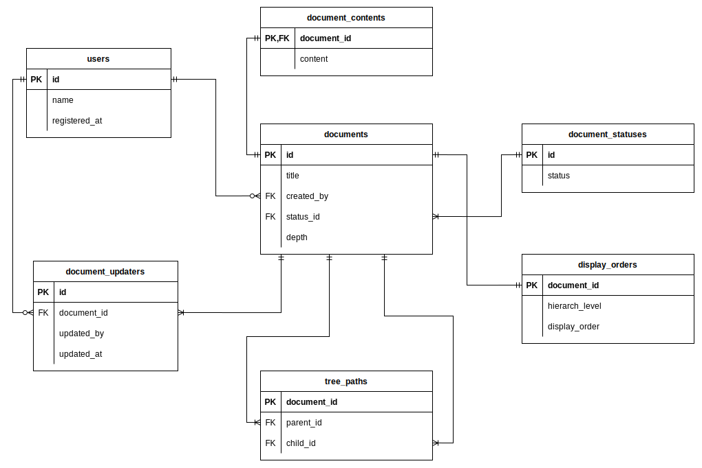

# クエリ確認手順

```sh
cd kurosawa/db_design/task3
docker compose up -d
```

下記にアクセス（PHPMyAdminでクエリを叩く場合）

http://localhost:8080/

<br>

# 課題1
## ER図

<br>

### ドキュメントID:6,7,8の階層情報を取得する
```sql
SELECT
	parent_id
    ,child_id
    ,parent_title
    ,dp.depth
FROM
	tree_paths as t 
    INNER JOIN (SELECT id, title as parent_title, depth FROM documents) as dp
    ON t.parent_id = dp.id
    INNER JOIN (SELECT id FROM documents) as dc
    ON t.child_id = dc.id
WHERE
	t.child_id in (6, 7, 8)
ORDER BY 
	child_id ASC
	,dp.depth ASC
```

### ドキュメントを新規に作成する
```sql
INSERT INTO documents (title, created_by, depth) VALUES
('踏み台サーバの情報', 3, 4); /* 階層はBackend側で取得 */

INSERT INTO document_contents (document_id, content) VALUES
(LAST_INSERT_ID(), '開発環境のRDSに接続する踏み台サーバ情報はこちら。hoge~~');

INSERT INTO tree_paths (parent_id, child_id)
	SELECT parent_id, LAST_INSERT_ID() 
	FROM tree_paths as t
	WHERE t.child_id = 3
	UNION ALL 
	SELECT LAST_INSERT_ID(), LAST_INSERT_ID() ;
```


### ドキュメントを移動する
先に、移動するドキュメントとその配下のtree_pathを削除して、その後に移動先のドキュメント配下に追加する処理を行う

```sql
/* 移動するドキュメントとその配下のtree_path情報を削除する */
DELETE FROM tree_paths
WHERE
child_id IN (SELECT x.id FROM (SELECT child_id as id
									 FROM tree_paths
									 WHERE parent_id = 6) AS x)
AND parent_id IN (SELECT y.id FROM (SELECT parent_id as id
									FROM tree_paths
									WHERE child_id = 6
									AND parent_id != child_id) AS y);
```
 - 一つ目の条件が、対象ドキュメントを含む配下のdocument_idを取得してIN句の条件式としている
   - parent_idで制限をかけると指定したドキュメントの配下に位置するドキュメント全てを指定できる
   - それらのchild_idは各ドキュメント自身のidを示しているため、対象ドキュメントを含む配下のdocument_idを取得するということになる
 - 二つ目の条件が、対象ドキュメントよりも上の階層を示すレコードを指定している
   - child_id=6（該当ドキュメント）を指定すると、自己参照+上の階層をparent_idとするレコードが存在する。
   - その中で自己参照（parent_id=6, child_id=6）を除くことで、対象ドキュメント含む配下の構造は対象外として、上階層のみをまとめて指定することができる（サブディレクトリのドキュメントに関しても）

<br>

```sql
/* 移動先の先祖と孤児となった移動ドキュメント群の組み合わせを示す行を挿入する */
INSERT INTO tree_paths (parent_id, child_id)
	SELECT supertree.parent_id, subtree.child_id
	FROM tree_paths as supertree
		 CROSS JOIN tree_paths as subtree 
	WHERE supertree.child_id = 9 /* 移動先 */
		  AND subtree.parent_id = 6; /* 移動ドキュメントと配下 */
```
 - cross joinで（parent_id, child_id）×（parent_id, child_id）のすべての組み合わせを作り出す
 - そこからsupertree.child_id=9で絞supertree.parent_idで先祖をすべて洗い出す
 - 同時に、subtree.parent_id=6で移動するドキュメントすべて洗い出す（子孫ドキュメントも全て含む）
 - それにより、（先祖）×（移動ドキュメント&子孫）の全ての組み合わせが洗い出せる


### ドキュメントを削除する
```sql
DELETE FROM tree_paths WHERE child_id = 18;
DELETE FROM document_contents WHERE document_id = 18;
DELETE FROM documents WHERE id = 18;
```

# 課題2

## ER図

<br>

- documentsにorder（順序）を持たせて、ソートできるようにする
- `ORDER BY child_id, depth, order` とすると各ドキュメントの階層状態を取得することができる
- 変更があった場合は、アプリケーション側で順序を定めてレコードを更新する
