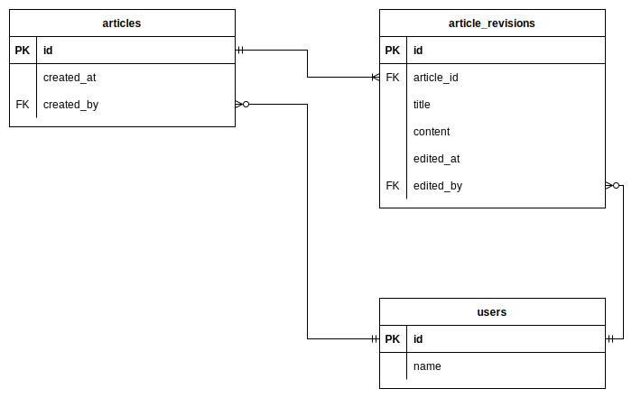

# 課題1

## ER図



## 記事を作成する（1000文字程度の本文を記入して保存できる）

```sql
INSERT INTO articles (id, created_by)
VALUES ('93364f36-c9e8-47d1-a1c2-87a0768de0eb','015b1aae-1ad6-54f4-5a88-7f7d85bc298f');

INSERT INTO article_revisions (article_id, title, content, edited_by)
VALUES ('93364f36-c9e8-47d1-a1c2-87a0768de0eb', 'スプレッドシートの豆知識', '
Googleスプレッドシートは、データを整理、共有、分析するための強力なツールです。スプレッドシートにデータを入力すると、そのデータを使って複雑な計算を行うことができます。スプレッドシートを開くと、新しいシートにすぐにアクセスできます。また、データをグラフやチャートなどの可視化することもできます。スプレッドシートは、共有したり、他のサービスと連携したり、他の人と共有したりすることができます。さらに、複数の人が同じデータを共有しながら作業を行えるように設計されています。Googleスプレッドシートを使うと、データを整理、共有、分析することができます。また、複数の人が同じデータを共有しながら作業を行えるようになります。さらに、データを可視化することもできます。Googleスプレッドシートはまた、他のサービスと連携したり、他の人と共有したりすることもできます。Googleスプレッドシートを使えば、データを簡単に整理、共有、分析することができます。また、他のサービスとの連携や他の人との共有も可能です。Googleスプレッドシートは、データを整理、共有、分析するのに最適なツールです。データをグラフやチャートなどの可視化することも可能なので、データをより分かりやすくすることができます。Googleスプレッドシートは、複数の人が同じデータを共有しながら作業を行うのに最適なツールです。他のサービスとの連携や他の人との共有も可能なので、協力しながら作業を行うことができます。Googleスプレッドシートを使えば、データの入力、整理、共有、分析、可視化などを簡単に行うことができます。Googleスプレッドシートは、データ管理や作業の効率化のために役立つツールです。Googleスプレッドシートを使えば、複雑なデータを整理、共有、分析、可視化することができます。また、他のサービスとの連携や他の人との共有も可能なので、協力しながら作業を行うことが可能です。Googleスプレッドシートを活用すれば、データの記録、整理、共有、分析、可視化などを行うことができます。このツールを使えば、データを効率よく管理し、分析して洞察を得ることができます。 Googleスプレッドシートは、データを管理したり、共有したり、可視化したりするのに便利なツールです。その他の便利な機能として、複数の人が同時に作業を行えるようになり、他のサービスとの連携や他の人との共有も可能になりました。Googleスプレッドシートを使えば、データを整理、共有、分析、可視化することができます。また、複数の人が同時に作業を行うことも可能です。さらに、他のサービスとの連携や他の人との共有も可能なので、より効率的な作業が可能になります。Googleスプレッドシートは、データを整理、共有、分析、可視化するのに最適なツールです。他の人と共有したり、他のサービスと連携したりすることも可能です。Googleスプレッドシートを活用すれば、データを効率的に管理し、分析して洞察を得ることができます。ぜひ、Googleスプレッドシートを使って、データを整理、共有、分析、可視化することで作業の効率化を図ってみてください！', '015b1aae-1ad6-54f4-5a88-7f7d85bc298f');
```

## 記事を編集する

```sql
INSERT INTO article_revisions (article_id, title, content, edited_at, edited_by) VALUES 
('72d4b0c0-f904-4e03-a8b1-0598cb833488', '記事1のタイトル（編集済み）をさらに編集', '記事1の内容（編集済み）をさらに編集', '2023-02-05 15:00:00', '015b1aae-1ad6-54f4-5a88-7f7d85bc298f');
```

## 特定の記事の履歴を一覧表示できる

```sql
SELECT
    *
FROM
    article_revisions
WHERE
    article_id = 'b9d3e800-0006-4451-81ea-287439ba4a3e'
ORDER BY
    edited_at DESC
;
```


## 履歴を選択して、過去の記事状態に戻す
履歴データを再度追加することで、過去の記事状態を作る。
gitでいうresetではなく、revert的なイメージ。

```sql
INSERT INTO article_revisions (article_id, title, content, edited_at, edited_by) VALUES 
('72d4b0c0-f904-4e03-a8b1-0598cb833488', '記事1のタイトル', '記事1の内容（編集済み）をさらに編集', '2023-02-06 15:00:00', '015b1aae-1ad6-54f4-5a88-7f7d85bc298f');

```

## 最新の記事一覧を取得する

```sql
SELECT *
FROM article_revisions
WHERE id in (SELECT MAX(id)
                       FROM article_revisions
                       GROUP BY article_id)
;
```


# 課題2

