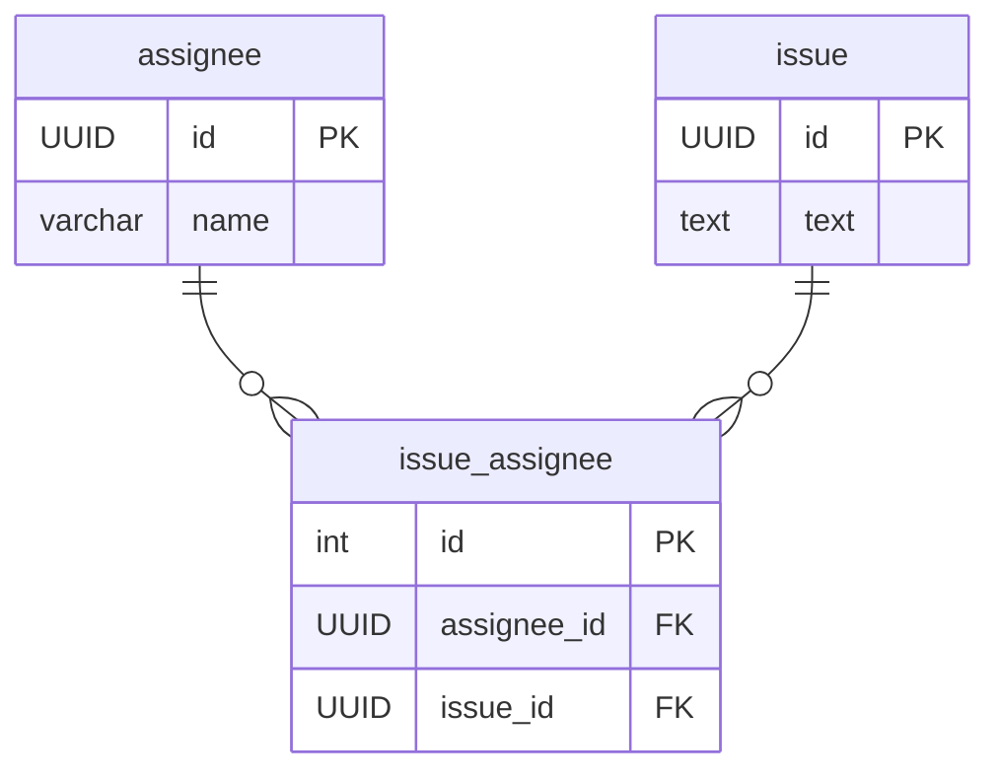

# 課題１

SELECT NULL = 0;

```
null
```

SELECT NULL = null;

```
null
```

SELECT NULL <> null;

```
null
```

SELECT NULL AND true;

```
null
```

SELECT NULL AND false;

```
false
```

SELECT NULL OR true;

```
true
```

SELECT NULL IS null;

```
true
```

SELECT NULL IS NOT null;

```
false
```


# 課題２




- NULLがあることは本当に悪なのか？についてトリオで議論する


# 課題3

 - Nullを利用してアプリケーション側で処理を書こうというケースもあるので、まず全体のNULLの扱いについて合意を取る必要がある
 - その上でNULL排除の方針となった時、NULLになる可能性があるカラムにNOT NULL制約をつける場合、DEFAULT値を設定する必要があるが、NULL相当を何とするかは齟齬が発生しないように共有しながらドキュメントに残していくことが大事。ただ新人エンジニアはここを独断で色々決めて設定してしまったことが問題だったのではないか。
 - 他にもNULLを排除するためにはテーブルを切り分けて管理するという対応方法もあり、この場合は1対多のリレーションにすることでDEFAULT設定をせずにNULLをテーブル上から排除することができる。これを考慮できていない可能性がある。


# 課題4

## NULL値を含むカラムでGROUP BYを行った場合、NULL値はどのようにグルーピングされますか？

A) 同一グループにまとめられます

B) 別々のグループにまとめられます

C) エラーが発生します

