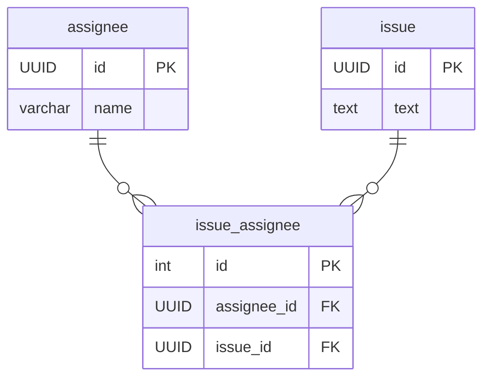

# 課題１

SELECT NULL = 0;

```
null
```

SELECT NULL = null;

```
null
```

SELECT NULL <> null;

```
null
```

SELECT NULL AND true;

```
null
```

SELECT NULL AND false;

```
false
```

SELECT NULL OR true;

```
true
```

SELECT NULL IS null;

```
true
```

SELECT NULL IS NOT null;

```
false
```


# 課題２




- NULLがあることは本当に悪なのか？についてトリオで議論する


# 課題3

 - 思考停止でNOT NULL付与してDEFAULT値を設定するよりも、オプショナルなデータはテーブルを切り分けてカラムを入れた方が良いということ？
 - 上司もNULL許容をするという姿勢はあるが、その手段としてよくなかったという意味で怒ってる？？


# 課題4

## NULL値を含むカラムでGROUP BYを行った場合、NULL値はどのようにグルーピングされますか？

A) 同一グループにまとめられます

B) 別々のグループにまとめられます

C) エラーが発生します

