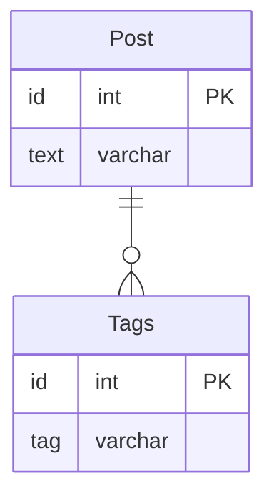

# 課題１

 - タグを検索するためにパターンマッチを利用する必要がある。その場合インデックスを利用できないため処理が長くなり、またRDBMSによってパターンマッチの記法は標準化されていないため、DBベンダー移行の柔軟性が下がってしまう。
 - タグの総数や、一番多いタグの集計など、本来であれば集約関数を使えば実現できることができなくなる
 - タグの追加をする際には、`tags || ',' || 'tagZ'` といった形で文字連結をしたものに書き換えをすれば実現ができるが、一方でソート順を維持するのが難しくなってしまう
 - タグを削除するには、アプリケーション側で処理をする必要が出てくる（データを取得し、カンマをもとに分割リスト化して、削除したいタグをremoveして再度カンマ区切りで連結して格納）。この場合、取得と更新の合計2回のクエリ発行をする必要が出てくる。
 - 型のバリデーションが効かないので、アカウントIDの妥当性をDB側で担保できない

# 課題２

上記の問題点を解決するよう、スキーマ設計を変更してみてください。投稿に対するタグの情報をどのように保持するのが適切でしょうか？新しいスキーマを考えて、DB設計のスケッチを描いてみてください

# 課題3

 - アンケートサービスで、複数選択可の項目（例えば興味のあるトピック）の場合、そこにカンマ区切りで回答番号を入れるようにしたら（「1,2,4」など）アンチパターンに陥る。

