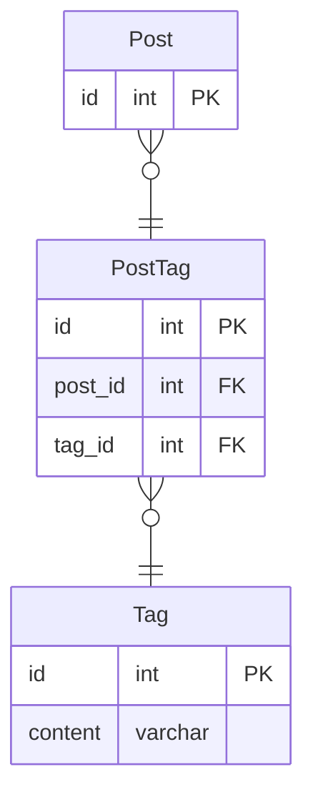

# 課題１

- データの取得はIN句を使えば割とシンプルに書けるので際立った問題はなさそう `WHERE 'tagA' IN (tag1ID, tag2ID, tag3ID)`
- データの追加・更新・削除をする際は、どこのカラムが空いているのか、またどこのカラムが該当のカラムなのかを確認する必要がある。データを取得して、アプリケーション側で確認する処理コードを記載する必要が出てくる
- ただしトランザクションが多いアプリケーションでは、データを取得して確認している際に、他の処理によって書き込みがされてしまい不整合につながってしまう懸念が出る。これを回避するためのコードを記載するのは複雑化を助長させてしまう。
- 同一タグが複数のカラムに存在してしまうといった、一意性をバリデーションで担保することができない
- 3つのカラムしか設けていないので、4つ以上に増やしたいという要望が出てきた時に柔軟に拡張することができない

# 課題２

どのようにテーブル設計を見直せばこの問題は解決できるでしょうか？新しいスキーマを描いてみてください

# 課題3

 - Slackのようなチャットサービスで、一つのチャンネルが複数のワークスペースに所属するようにする場合に、とりあえず1つ所属ワークスペースカラムを追加した時にアンチパターンに陥る