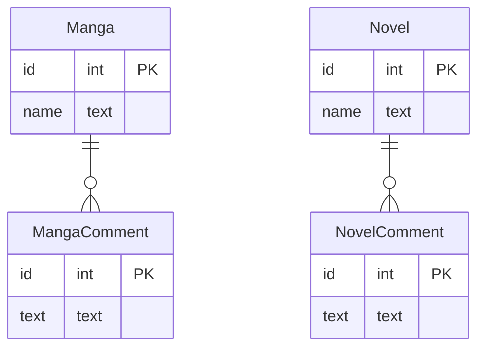

# 課題１

 - belongs_to_idに外部キー制約を付与できないので、データの参照整合性をバリデートすることができない（存在しないidを格納できてしまう）
 - 新しいエンティティを作成したいというときに `belongs_to_id` に何でも格納される可能性があり、データの秩序が乱れやすくなってしまう
 - WHEREで`type`の絞り込みを忘れると、意図しないコメントが紐づくリスクがある

# 課題２

# 課題3

 - 保険申込サービスを開発していると仮定する。選択肢1で条件分岐があって（例えば「直近半年に病気にかかったことはありますか？」→「はい/いいえ」）、以降の選択肢で質問される内容が異なる場合、「questionnare」に「question{1..n}」カラムがあって、そこにNULL許容という形で選択肢の分岐に問わずに格納できるように設計してしまう
