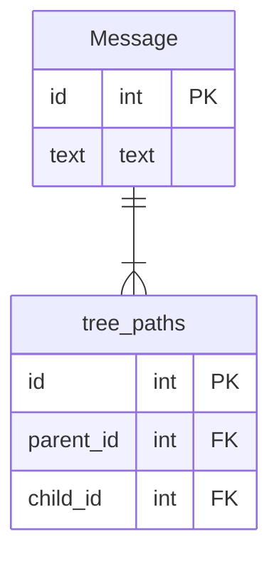

# 課題１

 - 1階層辿るごとにJOINを一つ増やす必要がある。このため処理時間が遅くなることや、MySQLだと61テーブルが最大数などの制約が発生してくる。

```sql
SELECT
    T1.text
    ,T2.text
    ,T3.text
    ,...
FROM
    Message as T1
    LEFT JOIN T2 (SELECT parent_message_id, text FROM Message) as T2
    ON T1.id = T2.parent_message_id
    LEFT JOIN T2 (SELECT parent_message_id, text FROM Message) as T3
    ON T2.parent_message_id = T3.parent_message_id
    ...
```


# 課題２

閉包テーブルを想定して記載する。




# 課題3

 - 記事メディアを開発していると仮定する。記事にコメントができる仕様であり、コメントに対してリプライできる機能を追加しようとした時、`Comments`テーブルにparent_idを追記して従属関係を表現しようとすると、このアンチパターンに陥る。