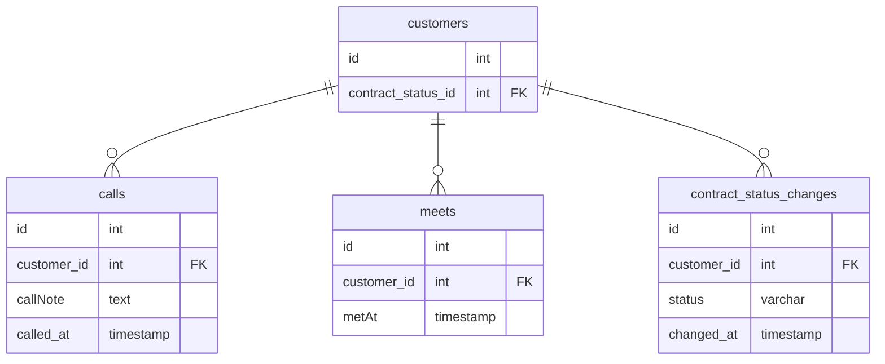

# 課題１

 - 商談の数が一つまでしか記録を保持できないため、商談を3回実施したら1,2回目のデータが上書きされて欠落してしまう。
 - その場合、1回目の面談の日時を知りたいとなったらRDBMSのバックアップ機能（スナップショットなど）で膨大なデータを遡って見つけ出し、確認する必要がある
 - 一度成約した後に解約した場合、こちらのNewCustomerどう更新するかを要検討する必要がある
 - 再契約の場合、過去の商談情報と現在の商談情報が混在してしまうリスクがある（正確なデータがわからないという状況に）

# 課題２

# 課題3

- 保険の申し込み申請。承認されるには健康状態の審査や口座等の審査がいくつか必要な仕様で、保険申請テーブルに対してそれぞれの審査カラムや審査日時を付け足してしまうと、再審査となった時に1回目の内容が上書きされてテーブル上で確認することがでいなくなってしまう