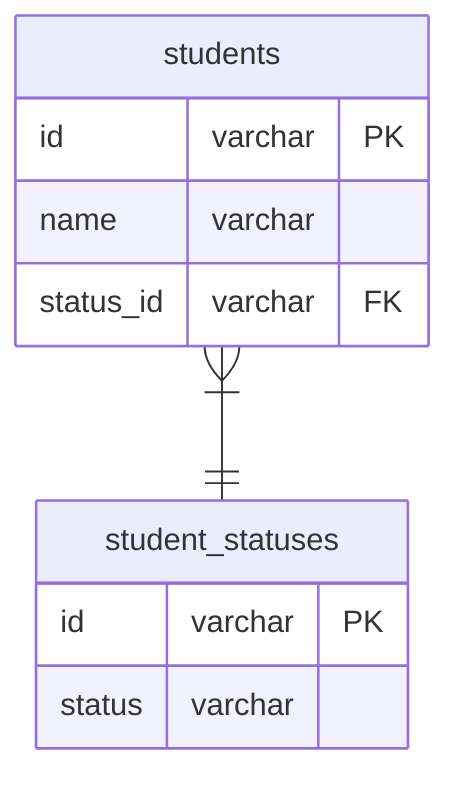

# 課題１

- 新しく値を追加したいときに、新規にALTER文でフィールドを再定義し、テーブルをつくりかえる必要が出てくる
- 値の名前を変えたい場合に、メタデータの改修が必要となってることに加えて、過去のデータも全てinvalidな値となるため失敗してしまう
- 上記により、サービスを一時停止する必要が出てくるかもしれない等、改修にあたるコストが高い
- またカラムの値（候補リスト）に何があるのかを取得するのがやや面倒

```sql

SELECT column_type 
FROM information_schema.columns 
WHERE table_schema = 'xxx_schema' 
AND table_name = 'tableA' 
AND column_name = 'status';

```


# 課題２




# 課題3

 - 転職サイトの求人掲載ステータスの管理をする際に「削除済み」「掲載終了」「審査中」「作成中」「掲載中」などがあるが、それをcheck制約で対応してしまうと、「掲載一時停止」などを追加したいときに大掛かりな改修となってしまう