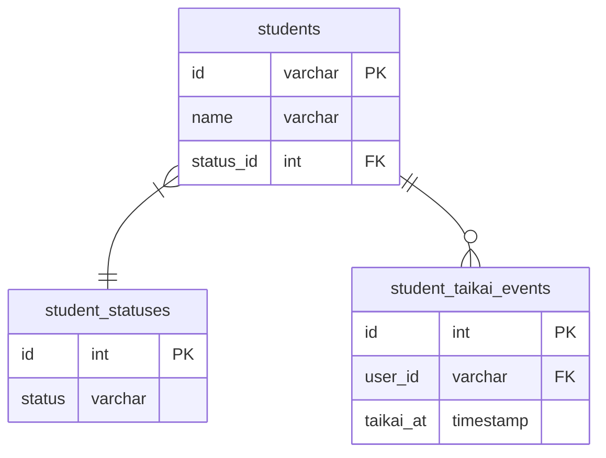

# 課題1

 - 全てのテーブルに削除フラグをつけることにも繋がり、クエリにはWHERE句がほとんど付きまとってくるようになる。認識の齟齬に繋がりやすい
 - このテーブルのデータは削除して問題ないという暗黙的な了解を植え付けてしまう（例えば請求レコードとか、手続きのログを残しておくべきなのに削除して良いのか？の検討機会を奪ってしまう）

# 課題2

# 課題3

ECサイトのOrderテーブルからid指定で削除する機能で起こりうる問題について

 - 関連付けられているデータも削除するかどうか（delete cascadeをONにするかどうか）みたいなところの仕様によっても変わって来る
 - delete cascade onの時
   - 注文詳細や注文履歴、会計などのレコードもまでも削除されるため、削除したというログを追うための工夫が必要となってくる
   - また誤って削除してしまった場合の復元対応をすることができない
 - delete cascade offの時
   - 注文詳細や注文履歴、会計などのレコードは残るが、参照先がNULLとなってしまうのでデータ不整合が発生してしまう
   - この場合集計をする際に値が異なるなど、運用上のデメリットが出てくる

学習塾の進捗管理サービスで生徒（Student）の退会機能

 - 物理削除してしまうと、復元ができない。そのため再度会員登録をするときに、復活という対応ができなくなる
 - またdelete cascade onの時
   - 過去の該当idに関わる全てのログが削除されてしまうため、分析に支障が出てくる
   - さらに、仮に該当idの人が何らかのコンテンツを作成して、それが誰かに利用されている場合、削除されてしまう。

過去を振り返って物理削除をしたか？それは妥当だったか？

 - 削除に関しては論理削除で対応してきました。基本的にはステータスで管理をしていて、マスタテーブルを用いて代理キーで紐付け、ステータスはマスタを変えることで変更可能という仕様です。
 - 物理削除は対応したことがないのでわかりません。