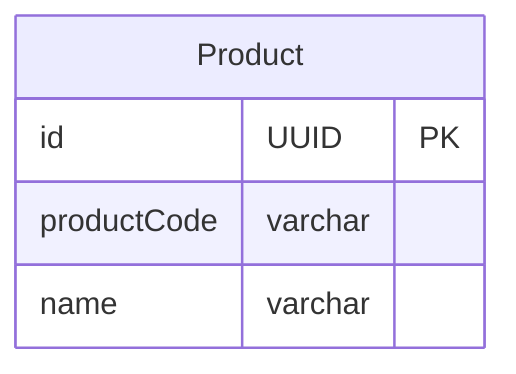

課題1

 - 商品コードが変わってUPDATEをかける際に、主キーとして用いられていると外部キーとして様々なテーブルに存在しているため、UPDATE処理が膨大になる
 - そのため商品コードの表示形式が変わった場合や、一部の商品コードが誤った記述だったことが発覚した時などに容易に変更することができない

課題2

 - 代理キーを設定する（UUIDや、serialなど）

課題3

 - `2023001`のような学籍番号は一意なのでそれを主キーとしたとする。ある年の人数が1000人を超えた時、3桁しか存在していないので4桁にしようと改修した時。
   - 主キーであり、外部キーとしても利用されているため、過去のデータを下4桁に変更し直すのに走る更新処理が膨大となる