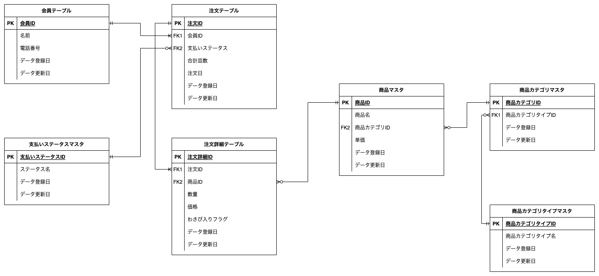
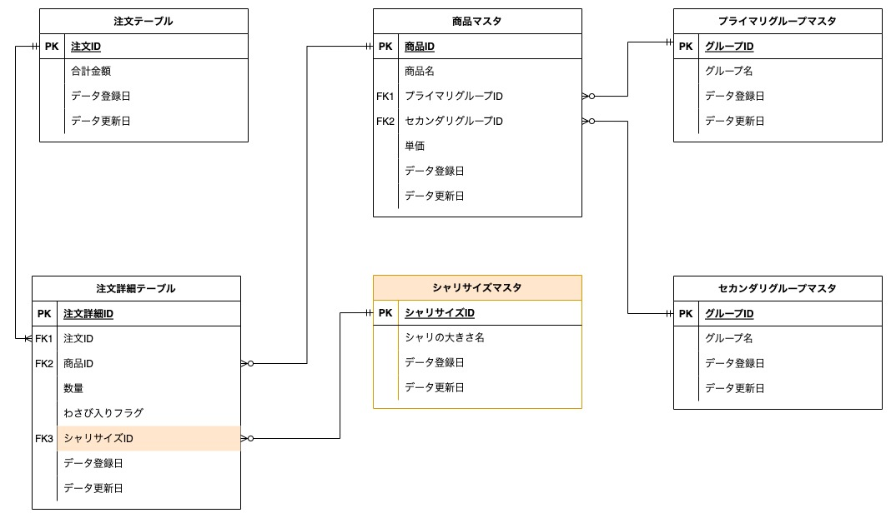
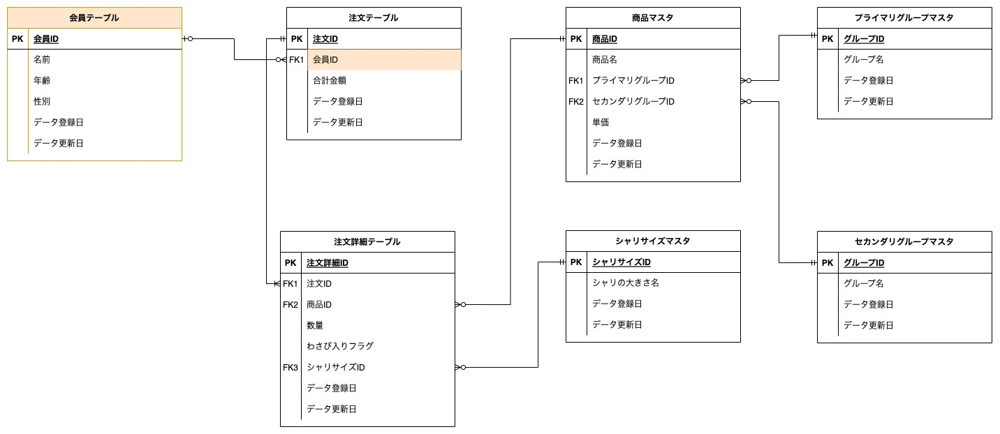

## 回答1
次のようなスキーマを考えました。



 - 会員テーブル
   - 会員データが格納されるテーブル
   - 1会員1行のデータが追加される
   - 注文テーブルと1対多のリレーションを持つ
 - 注文テーブル
   - 注文データが格納されるテーブル
   - 1注文1行のデータが追加される
   - また支払いステータスで注文の支払い有無を管理する
 - 注文詳細テーブル
   - 注文の中で何の商品が購入されたかが記録される
   - 商品xワサビ有無の数だけ行データが追加される
   - 注文テーブル、商品テーブルとリレーションを持つ
 - 支払いステータスマスタ
   - 支払いステータスを管理するマスタテーブル
   - 基本的に1:支払い済、2:未払いのような管理をイメージしている
 - 商品マスタ
   - 商品名、商品単価、商品種類(ex.セットメニュー)が格納されたマスタテーブル
   - 注文詳細テーブル、商品カテゴリマスタとリレーションを持つ
 - 商品カテゴリマスタ
   - 注文表で分けられている商品が属するカテゴリが格納されたマスタテーブル
   - 盛り込み、にぎり、一皿100円、一皿150円、などのカテゴリの名前が格納されている
   - 商品テーブルにリレーションを持つ
 - 商品カテゴリタイプマスタ
   - 商品のカテゴリの種類が格納されたマスタテーブル
   - セットメニュー、お好みすしといったカテゴリの種類の名前が格納されている
   - 商品カテゴリマスタにリレーションを持つ


ちなみに論理モデルと物理モデルの違いは、次のように考えています。

- 論理モデル
  - 目的：データモデルやその関係性を表現するもの
    - 業務要件を集約して、データモデルとして表現し、更にデータモデル同士の関係性を定義する
  - 作成者：主にアーキテクトや業務SE
  - スコープとなる設計内容
    - エンティティ名
    - エンティティの関連性
    - エンティティの属性（カラム）
    - テーブルの主キー
    - テーブルの外部キー
- 物理モデル
  - 目的：データベースを実際に作成するための設計
    - 論理設計で作ったエンティティ・属性に対して、実際のテーブル名・カラム名・データ型などを設計し、テーブルを作成できるようにする
  - 作成者：データベースエンジニア、管理者
  - スコープとなる設計内容
    - テーブルの主キー
    - テーブルの外部キー
    - テーブル名
    - カラムデータ型
    - インデックス


<br>
<br>


## 回答2
### シャリの大小を選べるようにする

 - 新たにシャリサイズマスタテーブルを作成する（ex. {シャリサイズID: 1, 名前: 大}）
 - 注文詳細テーブルにシャリサイズIDをカラムに追加する



意図
 - なぜ注文詳細テーブルに、is_bigみたいなbooleanのカラムを追加しなかったのか
   - 今後シャリサイズ中が現れたときにも対応できるように、カテゴリカルなデータの保持をした

<br>

### セット商品以外の寿司ネタが毎月どれくらい売れているかを知る

 - 上記で定義したスキーマで対応できると考える
   - ポイントは次のように考える
     - 注文詳細テーブルで商品毎にレコードが追加されるテーブル設計にする
     - 商品が"セット商品"か"お好みすし"なのかを判別することができる
 - 次のようなSQLを書くことで、毎月の寿司ネタごとの販売個数を算出する

```sql
SELECT
    DATE_FORMAT(注文詳細テーブル.データ登録日, "%Y-%m") as "販売月"
    ,商品テーブル.商品名 as "商品名"
    ,SUM(注文詳細テーブル.数量) as "合計販売個数"
FROM
    注文詳細テーブル
    LEFT JOIN 
    (
        SELECT
            *
        FROM
            商品マスタ
            LEFT JOIN 商品カテゴリマスタ USING(商品カテゴリID)
            LEFT JOIN 商品カテゴリタイプマスタ USING(商品カテゴリタイプID)
        WHERE
            商品カテゴリタイプID = お好みすしの商品カテゴリタイプIDID
    ) as "商品テーブル"
    ON 注文詳細テーブル.商品ID = 商品テーブル.商品ID
GROUP BY
    DATE_FORMAT(注文詳細テーブル.データ登録日, "%Y-%m") /* MySQLの仕様に準拠 */
    ,商品テーブル.商品名
;

```

<br>

## 回答3
### 追加で考えられる仕様
- 1. 割引クーポンが利用できる
  - 仕様1：企業は有効期限つきの割引クーポンを発行&ユーザーに配布でき、ユーザーはそれを会計時に利用すると合計金額から割引される
  - 仕様2：また同時に利用できるクーポンは一つまでである
  - オレンジ色で記載した箇所が追加設計部分になります
    - クーポンテーブルの追加（企業がクーポンを追加できます）
    - 所持クーポンテーブルの追加（ユーザーが所持しているクーポンを管理します）
    - 会計テーブルの追加（会計金額と適用されたクーポンIDを格納するテーブルです）
  
- 2. 予約注文ができる
  - 仕様：ユーザーはメニューの予約注文ができるようになる。これにより事前に注文をしておいて、xx日後に注文の品を購入&することができる
  - 水色で記載した箇所が追加設計部分になります
    - 新しく購入予約テーブルを作り、注文テーブルと紐づける
    - 予約注文の場合のみ、このテーブルにデータが追加される



<br>

## 回答4
MySQLのコンテナを作成し、回答3で記載したER図のもとにDB構築を行った。

### 前提
- docker composeが利用できる環境である

### 手順

1. イメージのダウンロードとコンテナ構築を行う
```sh
docker compose up -d
```


2. phpMyAdminにアクセスする

- 下記に接続

http://localhost:8080/


3. 実際の利用を想定したクエリを実行する

sushi データベースにアクセスし、画面上部にあるSQLタブからSQLクエリを実行できる


#### 3-1. 「セット商品以外の寿司ネタがどれくらい売れているかを知りたい」というデータ分析のケースを想定する。

```sql
SELECT
	i.item_name,
    SUM(od.quantity) as 合計販売個数
FROM
	order_details as od
    LEFT JOIN items as i
    ON od.item_id = i.item_id 
    LEFT JOIN item_categories as ic
    ON i.category_id = ic.category_id
    LEFT JOIN item_category_types as ict
    ON ic.category_type_id = ict.category_type_id
WHERE
	ict.category_type_id = 2
GROUP BY
	i.item_name
ORDER BY
	SUM(od.quantity) DESC;
```


#### 3-2. 「現在注文受付中ステータスの注文一覧を把握して、何日に何を用意すれば良いのかを把握したい」というデータ可視化のケースを想定する。

```sql
SELECT
	o.order_id as "注文ID",
    pr.purchase_reservation_at as "購入予定日",
    i.item_name as "商品名",
    wo.wasabi_option_name as "わさびオプション",
    rs.size as "サイズ",
    od.quantity as "個数"
FROM
	(
        SELECT
        	*
        FROM
        	orders
        WHERE
        	orders.order_status_id = 1
    ) as o
    LEFT JOIN order_details as od
    ON o.order_id = od.order_id
    LEFT JOIN purchase_reservations as pr
    ON o.order_id = pr.order_id
    LEFT JOIN items as i
    ON od.item_id = i.item_id
    LEFT JOIN wasabi_options as wo
    ON od.wasabi_option_id = wo.wasabi_option_id
    LEFT JOIN rice_sizes as rs
    ON od.rice_size_id = rs.rice_size_id
WHERE
	pr.purchase_reservation_at >= CURRENT_DATE()
ORDER BY
	pr.purchase_reservation_at ASC
;
```