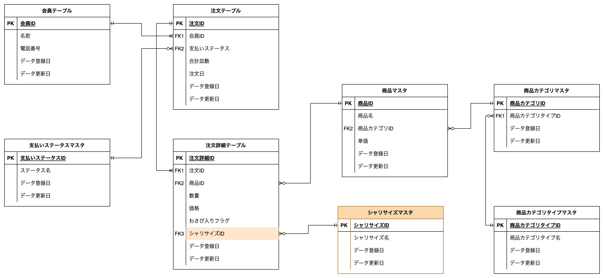

## 回答1
次のようなスキーマを考えました。


 - 注文テーブル
   - 1注文1行のデータが追加される
   - 注文の合計金額が格納される
 - 注文詳細テーブル
   - 注文の中で何の商品が購入されたかが記録される
   - 商品xワサビ有無の数だけ行データが追加される
   - 注文テーブル、商品テーブルとリレーションを持つ
 - 商品マスタ
   - 商品名、商品単価、商品種類(ex.セットメニュー)が格納されたマスタテーブル
   - 注文詳細テーブル、グループテーブルとリレーションを持つ
 - プライマリグループマスタ
   - 注文表で分けられている商品が属するグループが格納されたマスタテーブル
   - セットメニュー、お好みすしといった大カテゴリのグループ名が格納されている
   - 商品テーブルにリレーションを持つ
 - セカンダリグループマスタ
   - 注文表で分けられている商品が属するグループが格納されたマスタテーブル
   - 盛り込み、にぎり、一皿100円、一皿150円、などの小カテゴリのグループ名が格納されている
   - 商品テーブルにリレーションを持つ

ちなみに論理モデルと物理モデルの違いは、次のように考えています。

- 論理モデル
  - 目的：データモデルやその関係性を表現するもの
    - 業務要件を集約して、データモデルとして表現し、更にデータモデル同士の関係性を定義する
  - 作成者：主にアーキテクトや業務SE
  - スコープとなる設計内容
    - エンティティ名
    - エンティティの関連性
    - エンティティの属性（カラム）
    - テーブルの主キー
    - テーブルの外部キー
- 物理モデル
  - 目的：データベースを実際に作成するための設計
    - 論理設計で作ったエンティティ・属性に対して、実際のテーブル名・カラム名・データ型などを設計し、テーブルを作成できるようにする
  - 作成者：データベースエンジニア、管理者
  - スコープとなる設計内容
    - テーブルの主キー
    - テーブルの外部キー
    - テーブル名
    - カラムデータ型
    - インデックス


<br>
<br>


## 回答2
### シャリの大小を選べるようにする

 - 新たにシャリサイズマスタテーブルを作成する（ex. {シャリサイズID: 1, 名前: 大}）
 - 注文詳細テーブルにシャリサイズIDをカラムに追加する



意図
 - なぜ注文詳細テーブルに、is_bigみたいなbooleanのカラムを追加しなかったのか
   - 今後シャリサイズ中が現れたときにも対応できるように、カテゴリカルなデータの保持をした

<br>

### セット商品以外の寿司ネタが毎月どれくらい売れているかを知る

 - 上記で定義したスキーマで対応できると考える
   - ポイントは次のように考える
     - 注文詳細テーブルで商品毎にレコードが追加されるテーブル設計にする
     - 商品が"セット商品"か"お好みすし"なのかを判別することができる
 - 次のようなSQLを書くことで、毎月の寿司ネタごとの販売個数を算出する

```sql
SELECT
    DATE_FORMAT(注文詳細テーブル.データ登録日, "%Y-%m") as "販売月"
    ,商品マスタ.商品名 as "商品名"
    ,SUM(注文詳細テーブル.数量) as "合計販売個数"
FROM
    注文詳細テーブル
    INNER JOIN 
    (
        SELECT
            *
        FROM
            商品マスタ
        WHERE
            商品マスタ.プライマリグループ = "お好みすしのプライマリグループID"
    ) as "商品マスタ"
    ON 注文詳細テーブル.商品ID = 商品マスタ.商品ID
GROUP BY
    DATE_FORMAT(注文詳細テーブル.データ登録日, "%Y-%m") /* MySQLの仕様に準拠 */
    ,商品マスタ.商品名
;

```

<br>

## 回答3
### 追加で考えられる仕様
- 会員の場合、注文の合計金額を割引にする
  - 割引ロジックはCRUD処理を行うアプリケーション側で行うものとする
  - データベース側では、注文データが割引が適用されているかどうかを判別できるように設計する
    - 新たに会員テーブルを作る
    - 注文テーブルに会員IDカラムを追加する


<br>

## 回答4
MySQLのコンテナを作成し、回答3で記載したER図のもとにDB構築を行った。

### 前提
- docker composeが利用できる環境である

### 手順

1. イメージのインストールとコンテナ構築を行う
```sh
docker compose up -d
```

2. コンテナに入る
```sh
docker compose exec db bash
```

3. MySQLに接続する


```sh
mysql -u user -p
>Enter Password:p@ssw0rd

use sushi;
```

4. 各種テーブルを確認

- 下記のクエリを実行すると、各種テーブルを確認することができる。

```sql
show tables;

SELECT * FROM users;

SELECT * FROM items;

SELECT * FROM orders;

SELECT * FROM order_groups;

SELECT * FROM primary_groups;

SELECT * FROM secondary_groups;

SELECT * FROM rice_sizes;
```


5. 実際の利用を想定したクエリ

- 「セット商品以外の寿司ネタがどれくらい売れているかを知りたい」というデータ分析のケースを想定する。

```sql
SELECT
    items.name as item_name
    ,SUM(od.quantity) as total_quantity
FROM
    order_details as od
    INNER JOIN items
    ON od.item_id = items.id
WHERE
    items.primary_group_id != 1
GROUP BY
    items.name
;
```


出力結果
```
+--------------------+----------------+
| item_name          | total_quantity |
+--------------------+----------------+
| あじ               |              3 |
| いかの塩辛         |              9 |
| えんがわ           |             14 |
| オクラ軍艦         |              2 |
| おしんこ巻         |              5 |
| かにみそ軍艦       |              7 |
| コーン             |              5 |
| ずわいがに         |              2 |
| ツナサラダ         |              3 |
| とびっこ           |             11 |
| ねぎとろ           |              5 |
| ホタテ貝           |              9 |
| まぐろづくし       |              9 |
| ゆでげそ           |             16 |
| 特大海老           |             13 |
| 玉子               |              1 |
| 生たこ             |             18 |
| 白身づくし         |             12 |
| 真鯛               |             16 |
| 穴子               |             14 |
+--------------------+----------------+
```